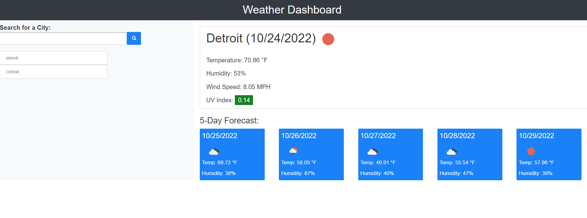

# Weather Dashboard
A dashboard using the Open Weather API

## Module 6 Challenge for MSU's Coding Bootcamp

## Objectives
* Create an interactive weather dashboard
* Searches are saved to be pulled up again
* Connect page to OpenWeather API
* Saves to local storage

## Completed Page

https://griffinnb.github.io/weather-dashboard/

Was created using previous activities and challenges in the bootcamp, along with tutorials and walkthroughs on google. Thank you to FreeCodeCamp for the helpful guides. Had trouble with the API key for a while, but was able to figure it out.